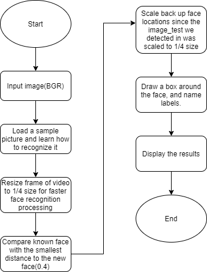

# **Installation**
    pip install -r requirements.txt

# **Description**

    face_recognition.py detect face using the algorythim HOG, it compare vector of input image to the vector of the original image.

# **Run**

    python face_recognitions.py 